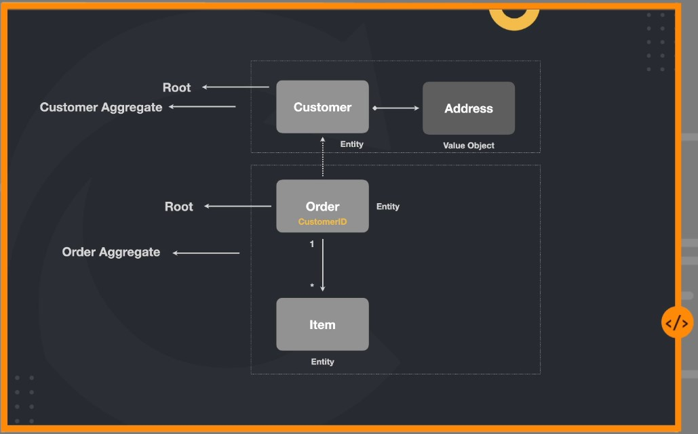
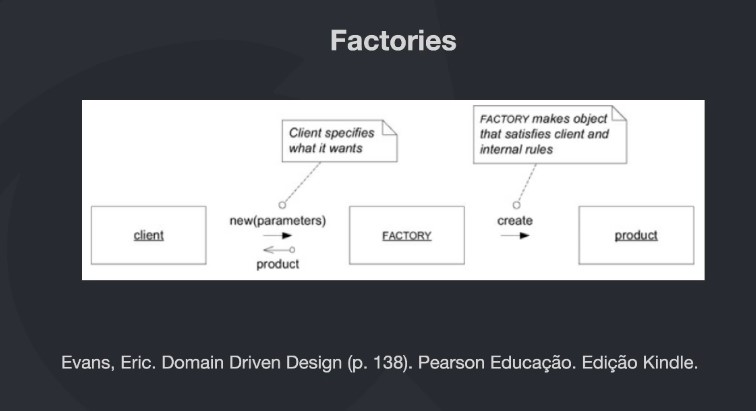

# DDD: Modelagem Tática e Patterns

## Introdução

### Elementos táticos

Quandos estamos falando sobre DDD e precisamos olhar mais a fundo um bounded context.
Precisamos ser capazes de modelarmos de forma mais assertiva os seus principais componentes, comportamentos e individualizades, bem como suas relações.

## Entidades

<i>Uma entidade é algo unico que é capaz de ser alterado de forma contínua durante um longo período de tempo.</i> <b>Vernon, Vaughn</b>
<i>Uma entidade é algo que possuí uma continuade em seu ciclo de vida e pode ser distinguida independente dos atributos que são importantes para a aplicação do usuário. Pode ser uma pessoa, cidade, carro, um ticket de loteria ou uma transação bancaria</i> <b>Evans, Eric</b>

Entidade = Identidade

### Entidade anemica

Entidade anemica é aquela entidade que só carrega dados (getters e setters), e que não possuí regras de negócio.

### Regras de negócio

### Consistencia constante em primeiro lugar

- Uma entidade tem sempre que representar o estado atual daquele elemento.
- Os dados a todo momento precisam estar consistentes

### Princípio da autovalidação

- Uma entidade por padrão, ela sempre terá que se autovalidar, se uma entidade não se autovalidar ela corre o risco de ficar com o estado inconsistente.

### Entidades vs ORM

- Sua entidade deve ser focada em negocio e não em persistência.
- Ter uma segunda entidade para persistir dados.
- Arquivos independentes, contextos diferentes.

```
Complexidade de negocio
domain
- Entity
- - customer.ts (regras de negocio)

Complexidade acidental
infra (mundo externo)
- Entity / Model
- - customer.ts (get, set)
```

## Value Objects

### Introdução aos objetos de valor

- Sempre que modelamos nossos dados para criar nossas entidades, sempre trabalhamos com tipos primitivos (nome, endereço e etc), e isso é uma forma "pobre" de lidar, e para tornar essa modelagem mais "rica" precisamos modelar da forma mais expressiva o possivel com as suas caracteristicas.

### Entendendo value objects

<p><i>Quando você se preocupa apenar com os atributos de um elemento de um model, classifique isso como uma Value Object.</i></p>
<p><i>Trate o Value Object como imutável.</i></p>
<p><b>Eric, Evans</b></p>

Address:

- Street
- City
- State
- Zip Code

- Evite tipos primitivos para tudo e comece a criar seus proprios tipos que representam um conjunto de propriedades que vão fazer sentido pro seu sistema
- Exemplo cpf: não é somente uma string, é um valor que se auto valida seguindo um conjunto de regras

## Agregados

### Introdução aos agregados

- Eventualmente uma entidade esta correlacionada com uma outra, como por exemplo um address que depende de um customer para fazer sentido.

### Entendendo agregados

_Um agregado é um conjunto de objetos associados que tratamos como uma unidade para propósito de mudança de dados_.
**Evans, Eric**



## Domain Services

_Um serviço de dominio é uma operação sem estado que cumpre uma tarefa específica do dominio. Muitas vezes, a melhor indicação de que você deve criar um Serviço no modelo de domínio é quanto a operação que você precisa executar parece não se encaixar como um método em um Agregado (10) ou em um Objeto de Valor (6)._
**Vernon, Vaughn**

_Quando um processo ou transformação significativa no domínio não for uma responsabilidade natural de uma ENTIDADE ou OBJETO DE VALOR, adicione uma operação ao modelo como uma interface autônoma declarada como um SERVIÇO. Define a interface baseada na linguagem do modelo de domínio e certifique-se de que o nome da operação faça parte do UBIQUITOUS LANGUAGE. Torne o SERVIÇO sem estado._ **Evans, Eric**

- Uma entidade pode realizar uma ação que vai afetar todas as entidades?
- Como realizar uma operação em lote?
- Como calcular algo cuja as informações constam em mais de uma entidade?

### Cuidados

- Quando houver muitos Domain Services em seu projeto, TALVEZ, isso pode indicar que seus agregados estão anêmicos.
- Domain Services são Stateless

## Repositories

_Um repositório comumente ser refere a um local de armazenamento, geralmente considerado um local de segurança ou preservação dos itens nele armazenados.
Quando você armazena algo em um repositório e depois retorna para recuperá-lo, você espera que ele esteja no mesmo estado que estava quando você colocou lá. Em algum momento, você pode optar por remover o item armazenado do repositório._
**Vernon, Vaughn**

_Esses objetos semelhantes a coleções são sobre persistência. Todo tipo Agregado persistente terá um Repositório. De um modo geral, existe uma relação um-para-um em um tipo Agregado e um Repositório._
**Vernon, Vaughn**

## Domain Events

### Introdução

_Use um evento de domínio para capturar uma ocorrência de algo que aconteceu no domínio._
**Vernon, Vaughn**

_A essência de um evento de domínio é que você o usa para capturar coisas que podem desencadear uma mudança no estado do aplicativo que você está desenvolvendo. Esses objetos de evento são processados para causar alterações no sistema e armazenados para fornecer um AuditLog._
**Fowler, Martin**

Todo evento deve ser representado em uma ação realizada no passado:

- UserCreated
- OrderPlaced
- EmailSent

#### Quando utilizar

Normalmente um Domain Event deve ser utilizado quando queremos notificar outros Bounded Contexts de uma mudança de estado.

#### Componentes

- Event
- Handler: Executa o processamento quando um evento é chamado
- Event Dispatcher: Responsável por armazenar e executar os handlers de um evento quando ele for disparado

#### Dinâmica

- Criar um "Event dispatcher"
- Criar um "Evento"
- Criar um "Handler" para o "Evento"
- Registrar o Evento, juntamento com o Handler no "Event Dispatcher"

Agora para disparar um evento, basta executar o método "notify" do "Event Dispatcher". Nesse momento todos os Handlers registrados no evento serão executados.

## Modelagem

_Em um contexto DDD, Módulos em seu modelo servem como contêineres nomeados para classes de objetos de domínio que são altamente coesas entre si. O objetivo deve ser baixo acoplamento entre as classes que estão em módulos diferentes. Como os Módulos usados no DDD não são compartimentos de armazenamento anêmicos ou genéricos, também é importante nomear adequadamente os Módulos._
**Vernon, Vaughn**

- Respeitar a linguagem universal
- Baixo acomplamento
- Um ou mais agregados devem estar juntos somente se fazem sentido
- Organizado pelo domínio / subdomínio e não pelo tipo de objetos
- Devem respeitar a mesma divisão quando estão em camadas diferentes

## Factories

_Desloque a responsabilidade de criar instâncias de objetos complexos e AGREGADOS para um objeto separado, que pode não ter uma responsabilidade no modelo de domínio, mas ainda faz parte do design do domínio. Forneça um interface que encapsule toda a criação complexa e que não exija que o cliente faça referenência às classes concretas dos objetos que estão sendo instanciados. Cria AGGREGATES inteiros de uma única vez, reforçando suas invariantes._
**Evans Eric**

### Dinâmica



A factorie recebe a ordem do cliente de como ele quer que o objeto seja criado com todas as regras para que o agregado fique pronto.
