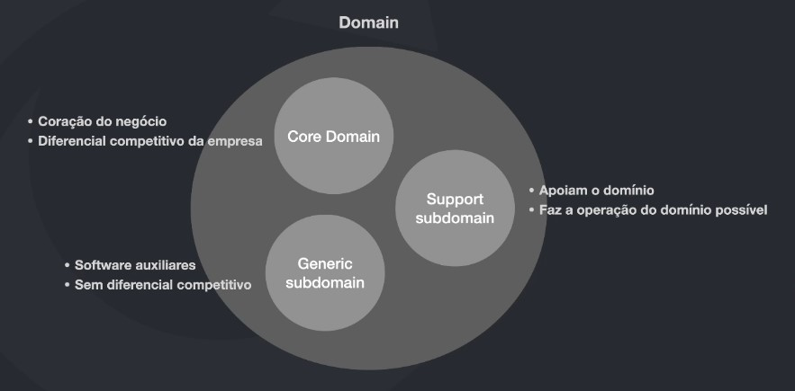
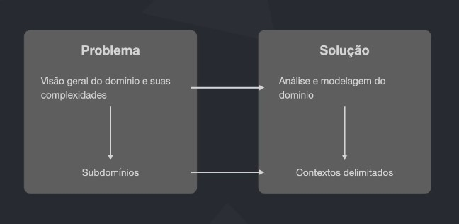
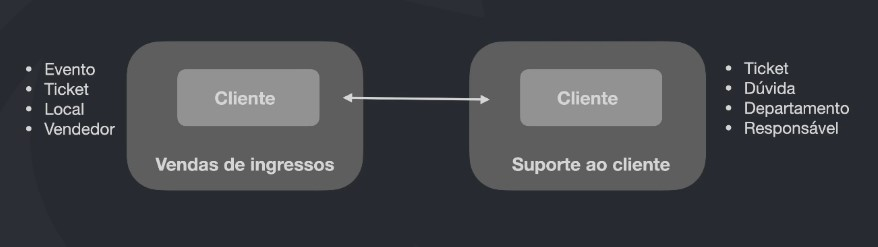
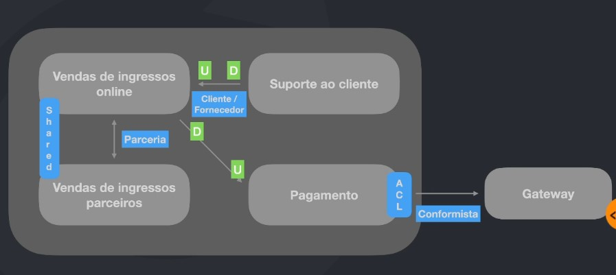

# Domain Driven Design

É uma forma de desenvolver software com o foco no coração da aplicação, entendendo suas regras, processos e complexidades.

## Introdução

### Softwares complexos

- DDD é/deve ser aplicado para casos de projetos de softwares complexos.
- Grandes projetos possuem muitas áreas, muitras regras de negócio, muitas pessoas com diferentes visões em diferentes contextos.
- Não há como não utilizar técnicas avançadas em projetos de alta complexidade.
- Grande parte da complexidade desse tipo de software não vem da tecnologia, mas sim da comunicação, separação de contextos, entendimento do negócio por diversos ângulos.
- Pessoas

### Como DDD pode ajudar?

- Entender com profundidade o domínio ou subdomínios da aplicação
- Ter uma linguagem universal (linguagem obíqua) entre todos os envolvidos
- Criar o design estratégico utilizando Bounded Context
- Criar o design tático para conseguir mapear e agregar as entidades e objetos de valor da aplicação, bem com os eventos de dominio.

### Resumindo

<i>In short, DDD is primarily about modeling a Ubiquitous Language in an explicitly Bounded Context.</i>
<b>Vernon, Vaugn.</b>

## Domínios, subdomínios e contextos

### Domínios e subdomínios

### Problema vs Solução

### Bounded Contexts

<i>A bounded context is an explicity boundary within which a domain model exists. Inside the boundary all terms and phrases of the Ubiquitous Language have specific meaning, and the model reflects the Language with exactness.</i> <b>Vernon, Vaughn</b>

### Contexto é Rei

### Elementos transversais

## Visão estratégica

Quando estamos pensando em fazer uma modelagem, precisamos ter uma visão geral de como as coisas se encaixam e as delimitações de contextos.

### Modelagem estratégica / Context Mapping

Em um cenário de vendas de ingressos online, suporte ao cliente, vendas de ingressos parceiros e pagamento.

- Separar em times as areas de vendas de ingressos online, suporte ao cliente, vendas de ingressos parceiros e pagamento
- Parceria entre vendas de ingressos online e venda de ingressos parceiros
- O time de vendas de ingressos online tem uma relação upstream e downstream com o time de pagamento
- O suporte ao cliente tem uma relação com o time de vendas de ingressos online
- A area de pagamento pode utilizar uma gateway, e essa gateway pode import a forma da area de pagamento trabalhar, tendo assim uma relação conformista.

### Padrões de Context Mapping

- Partnership
- Shared Kernel
- Customer-Supplier Development
- Conformist
- Anticorruption-layer
- Open host service
- Published language
- Separated ways
- Big Ball of Mud

https://github.com/ddd-crew/context-mapping
